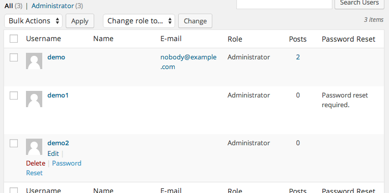

Password Reset
==============

WordPress plugin. Require select users to reset their password at next login.

On Users edit screen (`/wp-admin/users.php`), click 'Password Reset' link for users, this will toggle their password-reset status. Their current status will be shown in the Password Reset column.

Users that require a reset will be prompted the next time they attempt to log in - they must know their current password since this bypasses the email confirmation system.

